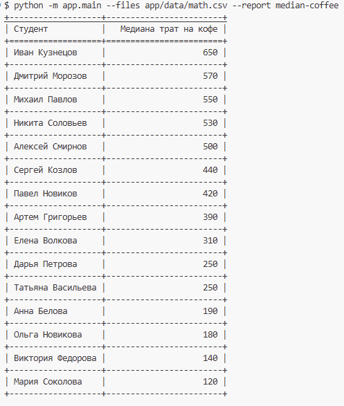
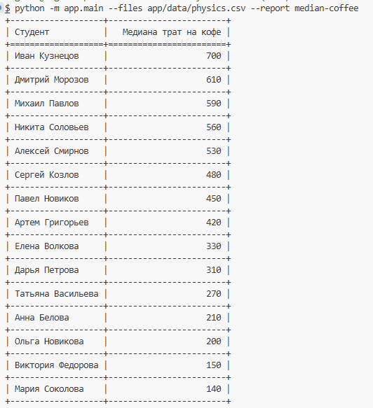
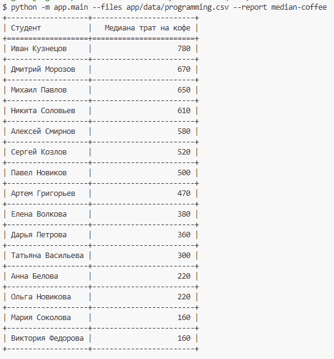
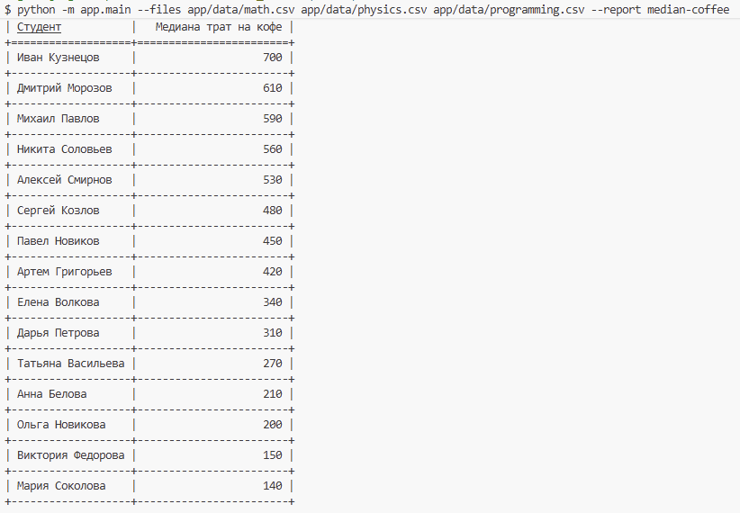

[](https://www.python.org/)
[](https://www.pytest.org/)

# Анализ данных о подготовке студентов к экзаменам

Скрипт для обработки CSV-файлов с данными о студентах и формирования отчётов.

## Функциональность

- Чтение данных из CSV-файлов о подготовке студентов к экзаменам
- Поддержка нескольких файлов одновременно
- Генерация отчёта `median-coffee` - медианная сумма трат на кофе по каждому студенту
- Архитектура с использованием фабрики отчётов для удобного добавления новых типов отчётов

## Требования

- Python 3.10+
- tabulate

## Установка зависимостей

```bash
pip install -r requirements.txt
```

## Примеры запуска









### Основной формат запуска

```bash
python -m app.main --files dir/file.csv --report median-coffee
```

### Пример с файлом

```bash
python -m app.main --files app/data/programming.csv --report median-coffee
```

## Примеры вывода отчёта

```
+-----------------+------------------------+
| Студент         | Медиана трат на кофе  |
+=================+========================+
| Иван Кузнецов   |                    650 |
+-----------------+------------------------+
| Алексей Смирнов |                    500 |
+-----------------+------------------------+
| Павел Новиков   |                    420 |
+-----------------+------------------------+
| Елена Волкова   |                    310 |
+-----------------+------------------------+
| Дарья Петрова   |                    250 |
+-----------------+------------------------+
| Мария Соколова  |                    120 |
+-----------------+------------------------+
```

## Формат входных данных

CSV-файл с колонками:
- student, date, coffee_spent, sleep_hours, study_hours, mood, exam

## Запуск тестов

```bash
pytest -v
```

## Архитектура

- `app/models/` - модели данных
- `app/services/` - сервисы и отчёты
- `app/core/` - argparse настройка
- `app/utils/` - фабрики
- `tests/` - тесты

### Автор
Evgeny Kudryashov: https://github.com/GagarinRu
